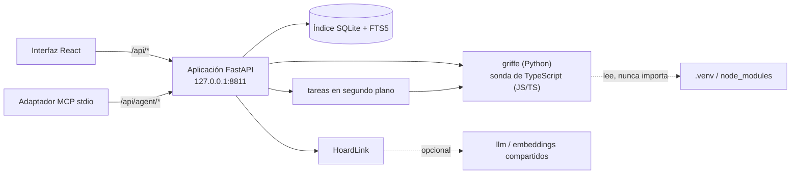

# Babel's Hoard
### ¿Qué dice de verdad la versión que tienes instalada?
**Un índice local y exacto de las API de los paquetes instalados en tus proyectos, y un comprobador que detecta API inventadas o mal usadas en el código que acaba de escribir un modelo, sin ejecutar nunca ese código.**

[English](README.md) · [Inicio rápido](#inicio-rápido) · [Conectarlo a Faustus](#conectarlo-a-faustus) · [Referencia MCP](docs/MCP.md) · [Portfolio](https://luissalet.github.io/Portfolio/#projects)


*Aplicación real, datos de demostración: el intérprete del propio Babel con httpx, pydantic, fastapi, griffe y el módulo json de la biblioteca estándar indexados.*

## Por qué

Los datos de entrenamiento de un modelo de código mezclan versiones de las
librerías. Escribe `df.append(...)` para pandas 2.x, pasa un argumento que
cambió de nombre, importa algo que se movió de módulo o llama a
`response.jsonify()` porque suena bien. Buscar en la web es lento y no
distingue versiones. La verdad ya está en el disco: el `.venv` y el
`node_modules` del propio proyecto. Babel los lee de forma estática,
responde con la firma real y comprueba fragmentos de código contra ellos.

El comprobador está pensado para que un modelo que no puede verificarlo se
fíe de él: **solo informa de un error cuando puede demostrarlo.** Un nombre
que falta en un módulo que hace `import *` de una extensión compilada (`os`,
`socket`), que rellena su espacio de nombres con `globals()` (`re`,
`hashlib`) o que resuelve nombres en `__getattr__` nunca se da como error; el
código protegido con `try/except ImportError` o `hasattr` no se toca. Lo que
no puede demostrar se cuenta como `unchecked` (sin verificar).


*Aplicación real, datos de demostración. El fragmento se analiza, nunca se ejecuta; `jsonify` se detecta gracias al tipo que devuelve `client.get` y a la variable de `with ... as client`.*

## Casos de uso

Cada uno se probó de verdad, en el navegador y por MCP, sobre un proyecto
FastAPI + React con 228 paquetes instalados
([casos de uso](docs/USE_CASES.md), [informe de usabilidad](docs/USABILITY_REPORT.md)):

- **Registrar un proyecto grande**: pegas su carpeta y en menos de un
  segundo se detectan el `.venv` y `frontend/node_modules`, se listan los
  paquetes instalados con su versión exacta y las dependencias de ejecución
  se indexan en segundo plano con el progreso a la vista (sin las
  herramientas de desarrollo).
- **Consultar una firma exacta**: escribes `sqlalchemy.ext.asyncio.async_sessionmaker`
  en Buscar y pulsas *Consultar*: los parámetros del constructor del
  SQLAlchemy instalado, aunque la primera pasada del índice se detuviera en
  el límite de tamaño.
- **Comprobar el código que ha escrito un modelo**: Python
  (`httpx.AsyncClient(retries=3)`, un `item.dict()` obsoleto en tu propio
  modelo de pydantic) e importaciones de TypeScript (`MagicWand` de
  `lucide-react`), cada aviso bajo su línea.
- **«Faustus, escríbelo y demuestra que existe»**: el agente consulta
  `httpx.AsyncClient.stream`, comprueba su endpoint, corrige los dos errores
  con las sugerencias y obtiene una comprobación limpia en cinco llamadas.
- **Revisar un módulo entero**: un servicio correcto de 370 líneas no da
  ningún aviso; tres errores introducidos vuelven como errores con su línea.
- **Buscar en tu propia documentación**: indexas la carpeta `docs/` del
  proyecto desde Docsets y encuentras «cómo arranco el backend» junto al
  índice de APIs.

## Qué está implementado

| Área | Disponible ahora | Límite |
| --- | --- | --- |
| Indexado de Python | Indexado estático (griffe sobre el código fuente y los stubs `.pyi`; el código del proyecto nunca se ejecuta) de las distribuciones y los módulos de la biblioteca estándar de cualquier intérprete registrado, cuando hace falta por primera vez y en caché por entorno + paquete + versión. En anchura, para que la API pública se indexe primero; cada objeto se expande una sola vez y sus otras rutas públicas apuntan a él; se resuelven clases base y reexportaciones de otros paquetes; se registra qué módulos y clases se conocen por completo (espacios de nombres dinámicos, límites, módulos compilados, subpaquetes de espacio de nombres, nombres de stubs declarados solo con `@overload`); un espacio de nombres que el límite dejó sin expandir se indexa la primera vez que una consulta o comprobación llega a él; se indexan todos los nombres de importación de una distribución (pytest: `py` y `pytest`) | Límites por paquete en la primera pasada: 15.000 entradas, 1.500 módulos analizados (sin las baterías de tests), 600 módulos de otros paquetes; una librería que los supera queda como `partial` y sus espacios de nombres incompletos nunca generan errores. Las extensiones compiladas sin stubs se registran como tales, sin miembros. No se indexan los módulos propios del proyecto que no estén instalados |
| Seguimiento de versiones | El sondeo del intérprete se reutiliza hasta que cambia su site-packages; tras una actualización, la siguiente consulta indexa la versión nueva y marca la anterior como `superseded` (solo se muestra como «otras versiones») | La detección se basa en la fecha de modificación de las carpetas de site-packages; las instalaciones editables que cambian el código sin reinstalar conservan lo indexado hasta reindexar |
| Comprobación de código (`api_check_code`) | Módulos y atributos inexistentes, argumentos por nombre inesperados, parámetros solo posicionales pasados por nombre, demasiados posicionales, obligatorios que faltan y API obsoletas, con sugerencias. Sigue los valores a través de importaciones, asignaciones, anotaciones, tipos de retorno, métodos que devuelven `Self`, `with`/`async with` (también funciones `@contextmanager` como `client.stream(...)`), `await` y clases definidas en el propio fragmento (a través de sus bases indexadas); distingue receptores (instancia, clase, estático, sin enlazar) y constructores; las sobrecargas se comprueban contra las que encajan con la llamada; `@deprecated` de PEP 702. Sin `env`, el código Python se comprueba contra el proyecto más reciente con intérprete y el TypeScript contra el más reciente con `node_modules` | Errores solo en espacios de nombres completos; las clases con `__getattr__` o `setattr(self, nombre)` y los módulos perezosos dan avisos; los tipos desconocidos, metaclases propias, `__new__`, decoradores desconocidos y el código protegido quedan sin verificar. TypeScript: solo importaciones y reexportaciones con nombre (v1) |
| Consulta (`api_lookup`) | Firma, parámetros (tipo, valor por defecto, obligatorio, tipo de paso, descripción), tipo de retorno, resumen, los primeros 1.500 caracteres del docstring, miembros, archivo:línea y versión de la librería; `found: false` con los nombres reales más parecidos y si la ausencia es segura | Paquetes de Python y paquetes npm con declaraciones de tipos |
| Indexado de JS/TS | API del compilador de TypeScript sobre las declaraciones del paquete (`types`/`typings`, `exports[...].types`, `index.d.ts`, `@types/<nombre>`): exportaciones, un nivel de miembros, JSDoc y `@deprecated`; se indexa al primer uso | Requiere Node.js; tipos y documentación de las primeras 500 exportaciones de un paquete, solo nombres del resto (hasta 50.000) |
| Búsqueda | FTS5 de SQLite con pesos bm25 (nombre, ruta, firma, resumen, documentación), tokens que entienden identificadores, filtros, un resultado por definición con su ruta más corta, reordenada para que las funciones y clases cuyo nombre coincide vayan antes que atributos y constantes, y sugerencias por trigramas; un nombre con puntos ofrece una consulta exacta que indexa el paquete en el momento | Léxica, sin embeddings; solo lo indexado |
| Documentación sin conexión | Catálogo e instalación de DevDocs (HTML convertido a Markdown y dividido por anclas) como tarea en segundo plano | Necesita red, solo cuando lo pide el usuario o el modelo; el conversor es pequeño, no un renderizador HTML completo |
| Carpetas de Markdown | `.md`/`.mdx`/`.rst`/`.txt` divididos por encabezado (respetando bloques de código y subrayados de rst) | Se omiten carpetas de dependencias, control de versiones y compilación; 2.000 archivos y 2 MB por archivo |
| Auditoría del asistente | Cada llamada a `/api/agent/*` (herramienta, resumen de argumentos, duración, resultado) en «Actividad del asistente»; la interfaz usa sus propios endpoints, así que solo aparecen las llamadas del modelo | Solo local |
| Preguntar a la documentación | Pantalla de Búsqueda: una pregunta se responde a partir de los mejores resultados de búsqueda con el modelo de `llm` compartido, con citas `[id]` que enlazan a la entrada exacta (y una lista de Fuentes; un id inventado por el modelo aparece tachado). Cuando el modelo de `embeddings` compartido resuelve, los 50 mejores resultados léxicos se reordenan de forma híbrida (fusión por rango recíproco del orden léxico y el de embeddings, distintivo «reordenación semántica activa»); si no, orden léxico | Solo responde con lo ya indexado; es una función de la interfaz, no una herramienta MCP; se desactiva mostrando el motivo cuando ningún modelo resuelve |
| Backend de modelos compartido | Ajustes → Modelos: qué servidor/modelo se usa ahora mismo para `llm`/`embeddings` y por qué, un botón «Comprobar de nuevo», ajustes manuales (URL/token de Faustus, URL/modelo por capacidad) | Ver [Modelos compartidos](#modelos-compartidos-hoardlink) más abajo |
| Interfaz | Búsqueda, panel de símbolo, Librerías (paquetes instalados con su estado de indexado, que se rellena mientras corre la tarea de dependencias; entorno predeterminado por lenguaje), Comprobar código (números de línea, avisos bajo cada línea), Docsets (con *Indexar una carpeta*), Actividad del asistente (qué entorno respondió a cada llamada) y Ajustes; tema claro/oscuro, inglés/español | Un solo usuario, navegador local; los mensajes del backend (avisos, notas) están en inglés |

## Inicio rápido

```
git clone https://github.com/Luissalet/BabelsHoard.git
cd BabelsHoard
```

### Windows

Haz doble clic en **`Iniciar Babel's Hoard.cmd`**. La primera vez,
`scripts/start.ps1` busca Python 3.13 (lanzador `py`, `C:\Python313` y
después el PATH; acepta 3.11 o superior), crea `.venv`, instala
`requirements-lock.txt`, compila la interfaz web y la sonda de TypeScript si
tienes Node.js, arranca la aplicación desde la carpeta del repositorio y
abre <http://127.0.0.1:8811> en cuanto `/api/health` responde. Las
siguientes veces solo reinstala si ha cambiado el archivo de bloqueo.
**`Detener Babel's Hoard.cmd`** la para.

Pasos a mano:

```powershell
python -m venv .venv
.venv\Scripts\python -m pip install -r requirements-lock.txt
cd frontend; npm ci; npm run build; cd ..
cd babels_hoard\probes; npm ci; cd ..\..
.venv\Scripts\python -m babels_hoard
```

### Linux / macOS

Python 3.11 o superior; Node.js 22 para la interfaz web y el indexado de
TypeScript:

```bash
python3 -m venv .venv
.venv/bin/python -m pip install -r requirements-lock.txt
(cd frontend && npm ci && npm run build)
(cd babels_hoard/probes && npm ci)
.venv/bin/python -m babels_hoard --demo --no-browser
```

Después abre <http://127.0.0.1:8811> (`curl http://127.0.0.1:8811/api/health`
responde `"service": "babels-hoard"`).

Opciones: `--port <p>` (8811 por defecto), `--data-dir <ruta>` (por defecto
`data/`, o `BABEL_DATA_DIR`), `--no-browser` y `--demo`, que usa
`data-demo/` e indexa unos cuantos paquetes del intérprete del propio Babel
para probar la interfaz sin tocar tus proyectos.

## Conectarlo a Faustus

Babel's Hoard es un plugin de [Faustus](https://github.com/Luissalet/Faustus),
el espacio de trabajo de IA local, y se declara con
[`faustus-plugin.json`](faustus-plugin.json).
Arranca Babel's Hoard y en Faustus ve a **Conectores → Apps cercanas →
Añadir**. Faustus lanza el adaptador stdio `babels_hoard/mcp_server.py`, que
habla con la aplicación por la interfaz local.

| Herramienta MCP | Qué hace | Solo lectura |
| --- | --- | --- |
| `docs_libraries` | Librerías indexadas con versiones, entornos (y cuál es el predeterminado) y tareas recientes | sí |
| `docs_search` | Búsqueda ordenada en API, docsets y markdown | sí |
| `api_lookup` | Firma, parámetros y documentación exactos de un símbolo instalado | sí (solo escribe la caché local del índice) |
| `api_check_code` | API inventadas, eliminadas o mal usadas en un fragmento | sí (solo escribe la caché local del índice) |
| `docs_read` | Leer por partes un docstring o una sección por su id | sí |
| `docs_add_environment` | Registrar una carpeta de proyecto, un intérprete o un node_modules | no |
| `docs_catalog` | Docsets descargables (red) | sí |
| `docs_install_docset` | Descargar e indexar un docset en segundo plano (red) | no |
| `docs_index_folder` | Indexar una carpeta de documentación markdown | no |

Cada descripción termina con palabras clave en inglés y en español para que
Faustus encuentre la herramienta. Formas de argumentos y resultados, límites
y ejemplos: [docs/MCP.md](docs/MCP.md). La skill para el agente está en
[skills/version-exact-apis/SKILL.md](skills/version-exact-apis/SKILL.md).

Funciona con cualquier cliente MCP por stdio:

```json
{
  "mcpServers": {
    "babels-hoard": {
      "command": "C:\\ruta\\a\\Babel's Hoard\\.venv\\Scripts\\python.exe",
      "args": ["C:\\ruta\\a\\Babel's Hoard\\babels_hoard\\mcp_server.py"],
      "env": { "BABEL_URL": "http://127.0.0.1:8811" }
    }
  }
}
```

## Modelos compartidos (HoardLink)

Babel's Hoard nunca carga su propio modelo. Para «Preguntar a la
documentación» usa dos capacidades de
[HoardLink](https://github.com/Luissalet/HoardLink) (incluida como copia en
[`babels_hoard/hoard_link/`](babels_hoard/hoard_link)), el backend de modelos
compartido que usan todos los plugins de Faustus:
`llm` para responder, `embeddings` para reordenar semánticamente los
resultados de búsqueda primero (búsqueda híbrida) cuando hay uno
disponible. Orden de resolución en una línea: un ajuste manual en Ajustes o
en `backend.json`, luego el propio registro de modelos de una instancia de
Faustus en marcha, luego un servidor ya escuchando en loopback (llama.cpp,
Ollama, cualquier servidor compatible con OpenAI) - **la aplicación
funciona por completo sin ningún modelo conectado**; el botón «Preguntar a
la documentación» simplemente queda desactivado con un motivo honesto («No
hay ningún modelo de lenguaje conectado...», y el detalle de la detección
como descripción emergente) y el resto de pantallas no se ven afectadas. Un
`backend.json` roto a mano nunca impide arrancar: la aplicación vuelve a la
detección automática y Ajustes -> Modelos explica por qué se ignoró el
archivo.

## Arquitectura

FastAPI + SQLite (WAL, una conexión por hilo, FTS5), un hilo de tareas en
segundo plano, griffe para el análisis estático de Python, la API del
compilador de TypeScript para las declaraciones, una interfaz React 19 +
Vite y un adaptador MCP por stdio independiente.



Módulos, modelo de datos y las decisiones detrás del comprobador:
[docs/ARCHITECTURE.md](docs/ARCHITECTURE.md).

## Privacidad y seguridad

Solo escucha en `127.0.0.1`; rechaza peticiones con un `Host` ajeno,
escrituras desde otros sitios y lecturas de la API desde otros sitios. Sin
telemetría. Solo el catálogo y la instalación de docsets usan la red (el
espejo público de DevDocs; su contenido mantiene sus licencias originales).
Babel ejecuta los intérpretes que registras únicamente para lanzar su
script de sondeo, que solo usa la biblioteca estándar, y solo si el archivo
se llama como un intérprete de Python; lee el código instalado y los
archivos de declaraciones, y nunca importa ni ejecuta el código del
proyecto ni los fragmentos que comprueba.
Cada llamada del asistente queda registrada en **Actividad del asistente**
(herramienta, resumen de argumentos, duración, resultado y qué entorno
respondió).

## Desarrollo

```powershell
.venv\Scripts\python -m pip install pytest pytest-asyncio
.venv\Scripts\python -m pytest -q
cd frontend; npm run build
```

En Linux/macOS, lo mismo con `.venv/bin/python`. **159 tests, entre 1 y 2
minutos en una máquina Linux compartida de 2 CPU**, sin red, sin GPU y sin
descargar modelos. Cubren: la
protección frente al navegador y el confinamiento de archivos estáticos
(intentos de salir de la carpeta), la forma de los errores, las conexiones
por hilo y que `/api/health` responda mientras corre una herramienta larga;
el indexado de paquetes reales instalados (httpx, pydantic, fastapi, PyJWT,
python-dotenv y la biblioteca estándar) y de dos paquetes de prueba:
`fakelib` 1.x/2.x (una API eliminada entre versiones) y `edgelib` (cada caso
de espacio de nombres dinámico, decorador, metaclase, sobrecarga y gestor de
contexto que el comprobador debe resolver bien); una actualización simulada
en un venv desechable; los nombres de la biblioteca estándar que antes daban
falsos positivos (`os.getcwd`, `socket.AF_INET`, `re.IGNORECASE`,
`hashlib.sha256`, `sqlite3.connect`); búsqueda, docsets, markdown e indexado
de JS/TS (requiere Node.js); el adaptador MCP lanzado con el **protocolo
stdio real** contra la aplicación en marcha, incluidas palabras clave,
anotaciones, ids que se pueden reutilizar y el paso de errores; y el
backend de modelos compartido (`/api/backend*`, la persistencia de la
configuración sin filtrar nunca el token de Faustus, campos vaciados,
valores no válidos rechazados antes de guardarse, un `backend.json` roto al
arrancar, y «Preguntar a la
documentación» - desactivada, pregunta vacía, sin resultados, filtrado de
citas, reordenación híbrida y una llamada al modelo fallida - todo contra
un Link simulado, sin red); y un test de regresión por cada hallazgo
corregido del [informe de usabilidad](docs/USABILITY_REPORT.md)
(`tests/test_usability_fixes.py`: entornos predeterminados por lenguaje,
distribuciones con varios paquetes, submódulos compilados y subpaquetes de
espacio de nombres, stubs solo con sobrecargas, expansión bajo demanda más
allá del límite, valores de gestores de contexto, clases del propio
fragmento, sobrecargas que encajan, orden de la búsqueda, listas grandes de
exportaciones JS y que ningún paquete analizado se quede en memoria tras
indexarlo).

Banco de falsos positivos: `scripts/check_corpus.py` pasa el comprobador
por el código de paquetes instalados, que funciona, así que cualquier error
que marque es sospechoso. En 300 archivos tomados de starlette, fastapi,
httpx, uvicorn, mcp, anyio, pydantic-settings, click, jsonschema, griffe,
pandas y requests no marca ningún error ni aviso (en la muestra de
pandas/requests: 4.954 comprobaciones verificadas y 11.551 sin verificar).
En 110 archivos de SQLAlchemy, pydantic-settings, sse-starlette, tenacity,
fastembed, psutil, chromadb, aiosqlite, alembic, PyJWT, pytest, attrs y
numpy (2.880 comprobaciones verificadas) marca 3 errores, todos reales: el
código del modo distribuido de chromadb importa módulos `*_pb2` que su
wheel no incluye. Las siete clases de falsos positivos que encontró están
corregidas y cubiertas por tests.

`npm run build` en `frontend/` termina sin errores de TypeScript. El primer
arranque de `scripts/start.ps1` (venv, instalación del bloqueo, compilación
de la interfaz, arranque, espera a `/api/health` y detección de una
instancia ya en marcha) se ha ejecutado con PowerShell 7 en Linux. La
[integración continua](.github/workflows/ci.yml) pasa los tests en Ubuntu y
Windows con Python 3.11, 3.12 y 3.13, compila la interfaz y, en
`windows-latest`, arranca la aplicación con `start.ps1` y la detiene con
`stop.ps1`.

## Hoja de ruta y límites conocidos

- Los módulos que generan sus nombres al importarse a partir de código de la
  plataforma (psutil) quedan sin verificar para no arriesgarse a errores
  falsos, así que un `psutil.gpu_percent()` inventado no se detecta.
- Los patrones de configuración de pydantic v1 (`class Config: orm_mode =
  True`) quedan fuera del alcance de una comprobación estática de nombres.
- Una consulta bajo demanda espera a que la tarea de dependencias termine la
  librería que está indexando en ese momento.
- En TypeScript solo se comprueban las importaciones y reexportaciones con
  nombre.
- Los mensajes de los avisos, el progreso de las tareas y las notas de las
  librerías llegan del backend en inglés, también con la interfaz en español.
- Pendiente de probar: los lanzadores en un Windows real, «Preguntar a la
  documentación» con un modelo de verdad, la descarga de docsets desde la
  interfaz y las capturas en modo oscuro.

La lista completa de hallazgos y cómo se encontró cada uno está en
[docs/USABILITY_REPORT.md](docs/USABILITY_REPORT.md).

## Licencia

MIT: consulta [LICENSE](LICENSE).
