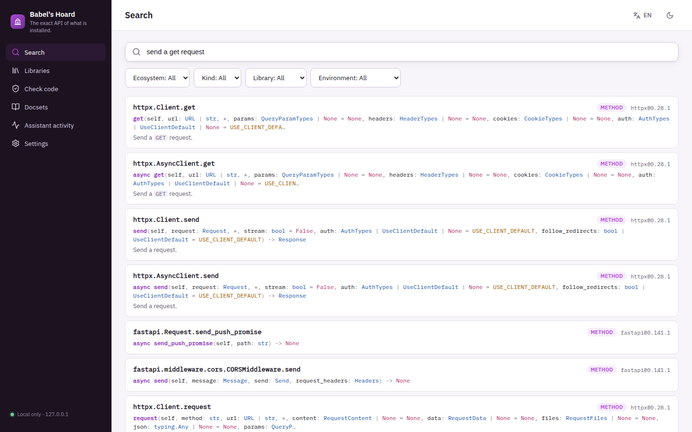
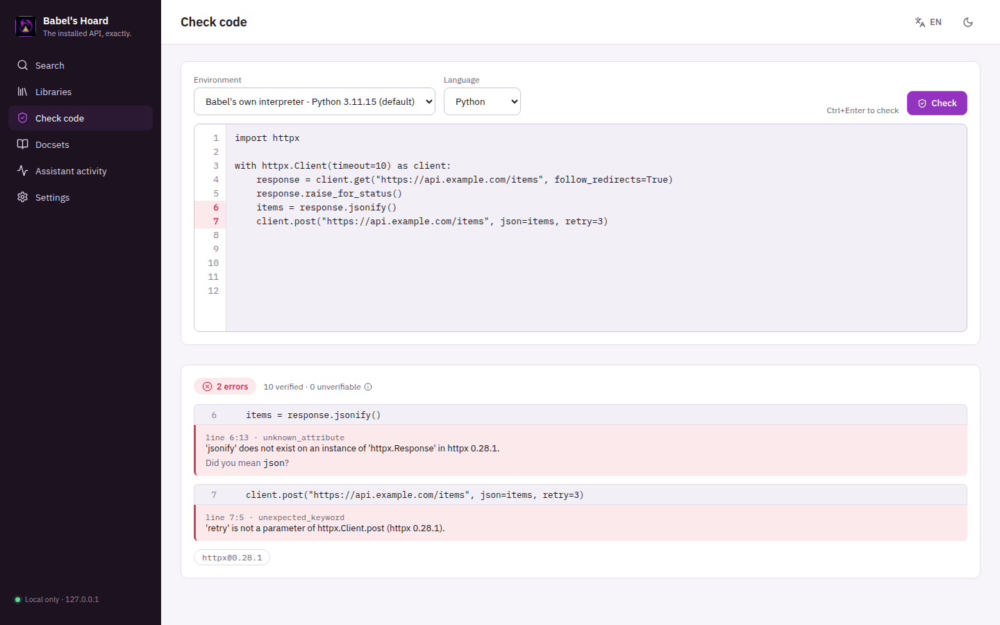

# Babel's Hoard
### What does the version on disk actually say?
**A local, version-exact API index of the packages installed in your projects, and a checker that catches hallucinated or misused APIs in code a model just wrote - without ever running that code.**

[Español](README.es.md) · [Run locally](#run-locally-on-windows) · [Connect an AI](docs/MCP.md) · [Portfolio](https://luissalet.github.io/Portfolio/#projects)


*Actual application, demo data: Babel's own interpreter with httpx, pydantic, fastapi, griffe and the json stdlib module indexed.*

## Why

A coding model's training data is a blur of library versions. It writes
`df.append(...)` for pandas 2.x, passes a keyword that was renamed, imports a
name that moved, or calls `response.jsonify()` because it sounds right. Web
search is slow and not specific to the version you have. The truth is already
on disk - the project's own `.venv` and `node_modules`. Babel reads them
statically, answers with the real signature, and checks a snippet against
them.

The checker is built to be trusted by a model that cannot double-check it:
**it only reports an error when it can prove it.** A name missing from a
module that star-imports a compiled extension (`os`, `socket`), fills its
namespace through `globals()` (`re`, `hashlib`), or resolves names in
`__getattr__` is never reported as an error; code guarded by
`try/except ImportError` or `hasattr` is left alone. What it cannot prove is
counted as `unchecked`.


*Actual application, demo data. The snippet is parsed, never executed; `jsonify` is caught through the return type of `client.get` and the `with ... as client` binding.*

## What is implemented

| Area | Available now | Boundary |
| --- | --- | --- |
| Python indexing | Static indexing (griffe over source and `.pyi` stubs, project code never runs) of any registered interpreter's distributions and stdlib modules, on first need and cached per environment + package + version. Breadth-first, so the public API is indexed first; every object expanded once with its other public paths linked to it; bases and re-exports from other packages resolved; completeness recorded per module/class (dynamic namespaces, caps, compiled modules) | Caps per package: 15,000 entries, 1,500 parsed modules (test suites skipped), 600 modules from other packages; libraries over a cap are marked `partial` and their incomplete namespaces never produce errors. Compiled extensions without stubs are recorded as such, with no members. The project's own (not installed) modules are not indexed |
| Version tracking | The interpreter probe is cached until its site-packages changes; after an upgrade the next lookup indexes the new version and marks the old index `superseded` (kept only as "other versions") | Detection relies on site-packages folder timestamps; editable installs that change code in place keep the indexed version until re-indexed |
| Code check (`api_check_code`) | Unknown modules/attributes, unexpected keywords, positional-only passed by keyword, too many positional, missing required, deprecated, with suggestions. Follows values through imports, assignments, annotations, return annotations, `Self`-returning methods, `with`/`async with` and `await`; receivers (instance/class/static/unbound) and constructors handled; overloads checked against their contract | Errors only for statically complete namespaces; `__getattr__`/`setattr(self, name)` classes and lazy modules produce warnings; unknown types, custom metaclasses, `__new__`, unknown decorators and guarded code are `unchecked`. TypeScript: named imports/re-exports only (v1) |
| Lookup (`api_lookup`) | Signature, parameters (type, default, required, kind, description), return type, summary, first 1,500 characters of the docstring, members, source file:line, library version; `found: false` with real neighbouring names and whether absence is certain | Python and npm packages with type declarations |
| JS/TS indexing | TypeScript compiler API over a package's declarations (`types`/`typings`, `exports[...].types`, `index.d.ts`, `@types/<name>`): exports, one level of members, JSDoc, `@deprecated`; indexed on first use | Needs Node.js; at most 500 exports per package (then `partial`) |
| Search | SQLite FTS5 with bm25 weights (name, qualname, signature, summary, doc), identifier-aware tokens, filters, one hit per definition, trigram "did you mean" | Lexical, no embeddings |
| Offline docsets | DevDocs catalogue and install (HTML converted to Markdown, split by anchors) as a background job | Needs the network, only when the user or the model asks; converter is small, not a full HTML renderer |
| Markdown folders | `.md`/`.mdx`/`.rst`/`.txt` split by heading (fenced code aware, rst underlines) | Dependency/VCS/build folders skipped; 2,000 files, 2 MB per file |
| Assistant audit | Every `/api/agent/*` call (tool, argument summary, duration, result) in "Assistant activity"; the UI uses its own endpoints so only the model's calls appear | Local only |
| UI | Search, symbol panel, Libraries (installed packages with index status), Check code (line numbers, findings under each line), Docsets, Assistant activity, Settings; light/dark, English/Spanish | Single user, local browser |

## Connect it to Faustus

The app declares itself with [`faustus-plugin.json`](faustus-plugin.json).
Start Babel's Hoard, then in Faustus: **Connectors → Nearby apps → Add**.
Faustus launches the stdio adapter `babels_hoard/mcp_server.py`, which talks
to the app over loopback.

| MCP tool | What | Read-only |
| --- | --- | --- |
| `docs_libraries` | Indexed libraries with versions, environments (and which is default), recent background jobs | yes |
| `docs_search` | Ranked search over APIs, docsets and markdown | yes |
| `api_lookup` | Exact installed signature, parameters and doc of one symbol | yes (writes only the local index cache) |
| `api_check_code` | Hallucinated/removed/misused APIs in a snippet | yes (writes only the local index cache) |
| `docs_read` | Read a docstring or docs section by id, in chunks | yes |
| `docs_add_environment` | Register a project folder, interpreter or node_modules | no |
| `docs_catalog` | Downloadable offline docsets (network) | yes |
| `docs_install_docset` | Download and index a docset as a background job (network) | no |
| `docs_index_folder` | Index a folder of markdown docs | no |

Every tool description ends with English and Spanish keywords for tool
retrieval. Argument and result shapes, limits and examples:
[docs/MCP.md](docs/MCP.md). A skill for the agent is in
[skills/version-exact-apis/SKILL.md](skills/version-exact-apis/SKILL.md).

Any MCP client can use it over stdio:

```json
{
  "mcpServers": {
    "babels-hoard": {
      "command": "C:\\path\\to\\Babel's Hoard\\.venv\\Scripts\\python.exe",
      "args": ["C:\\path\\to\\Babel's Hoard\\babels_hoard\\mcp_server.py"],
      "env": { "BABEL_URL": "http://127.0.0.1:8811" }
    }
  }
}
```

## Run locally on Windows

Double-click **`Iniciar Babel's Hoard.cmd`**. On first run
`scripts/start.ps1` finds Python 3.13 (py launcher, `C:\Python313`, then
PATH; 3.11+ accepted), creates `.venv`, installs `requirements-lock.txt`,
builds the web UI and the TypeScript probe if Node.js is installed, starts
the app from the repository folder and opens <http://127.0.0.1:8811> once
`/api/health` answers. Later runs reinstall only when the lock file changed.
**`Detener Babel's Hoard.cmd`** stops it.

Manual steps:

```powershell
python -m venv .venv
.venv\Scripts\python -m pip install -r requirements-lock.txt
cd frontend; npm ci; npm run build; cd ..
.venv\Scripts\python -m babels_hoard
```

Options: `--port <p>` (default 8811), `--data-dir <path>` (default `data\`,
or `BABEL_DATA_DIR`), `--no-browser`, and `--demo`, which uses `data-demo\`
and indexes a few packages of Babel's own interpreter so the UI can be tried
without touching your projects.

## Architecture

FastAPI + SQLite (WAL, one connection per thread, FTS5), a background job
worker, griffe for static Python analysis, the TypeScript compiler API for
declarations, a React 19 + Vite UI and a standalone stdio MCP adapter.
Modules, data model and the decisions behind the checker:
[docs/ARCHITECTURE.md](docs/ARCHITECTURE.md).

## Tests

```powershell
.venv\Scripts\python -m pytest -q
```

**108 tests, 40-60 s in a shared 2-CPU container, offline.** They cover: the
browser guard and static-file confinement (path traversal attempts), error
shapes, per-thread connections and a health check that answers while a
long tool runs; indexing of real installed packages (httpx, pydantic,
fastapi, PyJWT, python-dotenv, the stdlib) and of two fixture packages -
`fakelib` 1.x/2.x (an API removed between versions) and `edgelib` (every
dynamic-namespace, decorator, metaclass, overload and context-manager case
the checker must get right); a simulated upgrade inside a throwaway venv;
the stdlib names that used to be false positives (`os.getcwd`,
`socket.AF_INET`, `re.IGNORECASE`, `hashlib.sha256`, `sqlite3.connect`);
search, docsets, markdown and JS/TS indexing (needs Node.js); and the MCP
adapter spawned over the **real stdio protocol** against a live app,
including tool keywords, annotations, id round-trips and error pass-through.

False-positive harness: `scripts/check_corpus.py` runs the checker over
the source of installed packages, which works, so any error it reports is
suspect. On 300 files sampled from starlette, fastapi, httpx, uvicorn, mcp,
anyio, pydantic-settings, click, jsonschema, griffe, pandas and requests it
reports no errors and no warnings (the pandas/requests sample: 4,954
verified checks, 11,551 left unchecked). Four false-positive classes it
found are fixed and covered by tests.

`npm run build` in `frontend/` passes with zero TypeScript errors. The
first-run path of `scripts/start.ps1` (venv, lock install, UI build, start,
health wait, second-run detection) was run under PowerShell 7 on Linux; the
CI workflow also defines a `windows-latest` job that runs `start.ps1` and
`stop.ps1`, which has not run yet because the repository has not been pushed.

## Privacy and limits

Binds `127.0.0.1` only; requests with a foreign `Host`, cross-site writes
and cross-site API reads are refused. No telemetry. Only the docset
catalogue and docset installs use the network (the public DevDocs mirror;
docset content keeps its original licences). Babel runs the interpreters
you register, only to execute its stdlib-only probe script, and only files
named like a Python interpreter; it reads installed source and declaration
files and never imports or executes project code or snippets.
